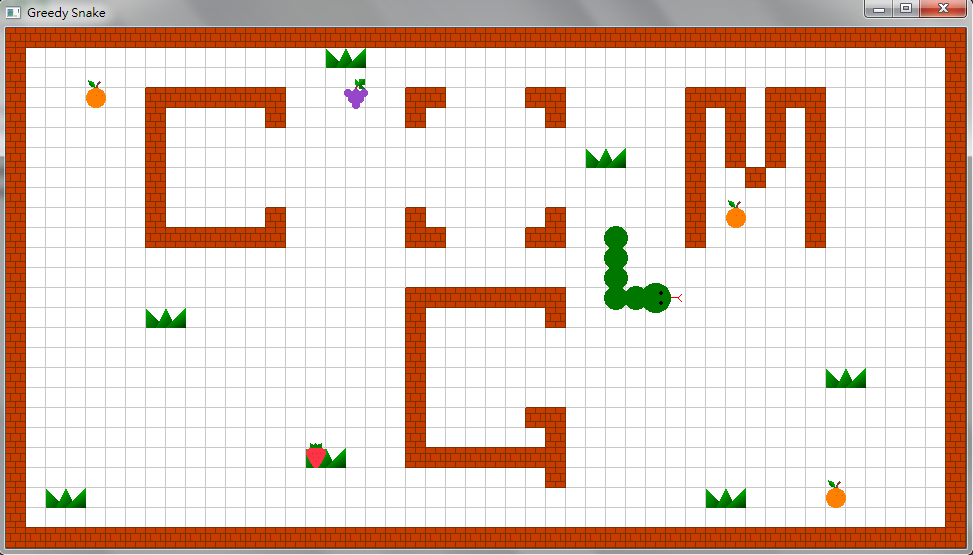
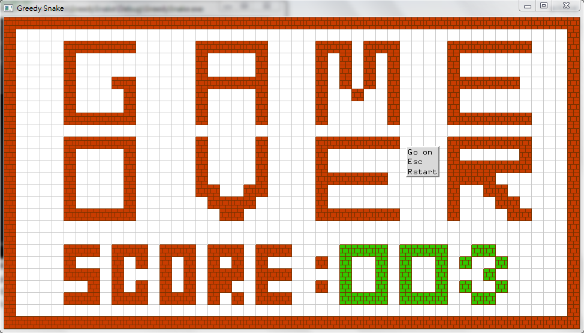

# GreedySnake
A simple 2D game developed using OpenGL.

### Function
1. UI介面:點滑鼠右鍵出現選項
	- Go on
	- Esc
	- Restart
2. 物件: 水果(橘子、草莓、葡萄)，主角(蛇頭、身體)
3. 初始設置: 遊戲區域內會有五個隨機種類的水果出現在隨機位置
4. 持續動作: 蛇會朝蛇頭目前面向的方向一直前進
5. 玩家控制: 
	- "↑"蛇頭向上
	- "←"蛇頭向左
	- "→"蛇頭向右
	- "↓"蛇頭向下
	- "PageUP"暫停
	- "PageDown"繼續
	- 身體會跟著蛇頭移動，身體座標為前一格身體上一次的座標
6. 得分判斷: 吃到水果後
	- 該水果會消失，並在遊戲區域內隨機位置出現一個隨機種類的新水果
	- 會得一分，得分最多可顯示三位數
	- 身體會加長一格
7. 結束判斷: 蛇頭碰到牆壁或自己的身體即結束，會跳到顯示分數的Game Over畫面

### Screenshot

